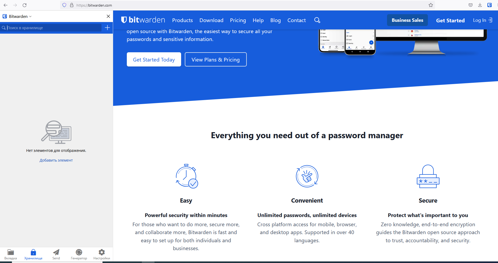
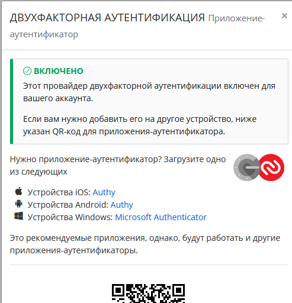
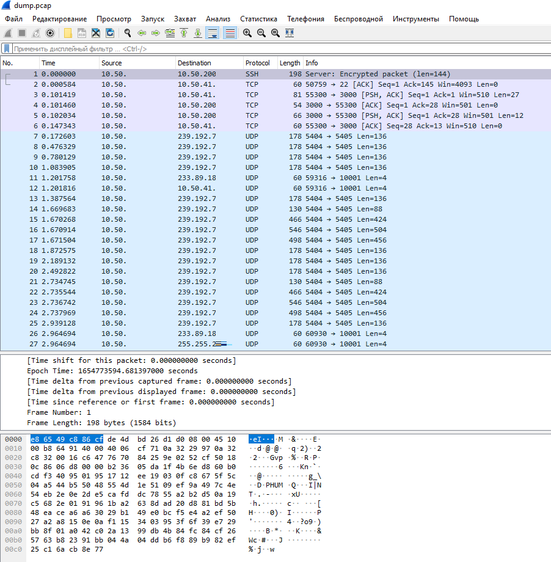

# 03-sysadmin-09-security

## 1. Установите Bitwarden плагин для браузера. Зарегестрируйтесь и сохраните несколько паролей.  

Установил Bitwarden:  



## 2. Установите Google authenticator на мобильный телефон. Настройте вход в Bitwarden акаунт через Google authenticator OTP.  

Сделано:  


## 3. Установите apache2, сгенерируйте самоподписанный сертификат, настройте тестовый сайт для работы по HTTPS.

Не так давно делел на работе:  
```
openssl req -x509 -nodes -days 3650 -newkey rsa:2048 -keyout /etc/httpd/ssl_cert/apache.key -out /etc/httpd/ssl_cert/apache.crt
```
После ввода запроса будет открыта командная строка, в которой можно ввести информацию о сайте.  
Рассмотрим подробнее вышеприведенную команду:  
* openssl: базовый инструмент командной строки для создания и управления сертификатами, ключами и другими файлами OpenSSL;  
* req -x509: эта опция указывает, что в команде нужно использовать запрос на подпись сертификата (CSR) X.509. X.509 – это стандарт инфраструктуры открытых ключей, которого придерживаются SSL и TLS в управлении ключами и сертификатами.  
* -nodes: благодаря этой опции OpenSSL не станет защищать сертификат паролем. Веб-сервер Apache должен иметь возможность читать файл без вмешательства пользователя; в этом случае пароль будет мешать, так как его придется вводить вручную после каждой перезагрузки.  
* -days 3650: эта опция устанавливает срок действия сертификата (в данном случае сертификат действителен в течение 10 лет).  
* -newkey rsa:2048: эта опция одновременно создает сертификат и ключ. Поскольку ключ, который необходим для подписи сертификата, не был создан ранее, его нужно создать сейчас. Опция rsa:2048 создаст 2048-битный RSA-ключ.  
* -keyout: данная строка задает каталог, в который нужно поместить закрытый ключ.  
* -out: указывает каталог, в который нужно поместить сертификат.  

Конфиг апача:
```
<VirtualHost *:443>
 SSLEngine on
 SSLCertificateFile /etc/pki/tls/certs/localhost.crt
 SSLCertificateKeyFile /etc/pki/tls/private/localhost.key
<Directory /var/www/web/sitename/content>
 AllowOverride All
</Directory>
 DocumentRoot /var/www/web/sitename/content
 ServerName sitename.domain.com
</VirtualHost>
```

## 4. Проверьте на TLS уязвимости произвольный сайт в интернете (кроме сайтов МВД, ФСБ, МинОбр, НацБанк, РосКосмос, РосАтом, РосНАНО и любых госкомпаний, объектов КИИ, ВПК ... и тому подобное).

Просканиовал ya.ru  
https://www.ssllabs.com/ssltest/analyze.html?d=ya.ru&s=87.250.250.242&hideResults=on&ignoreMismatch=on

## 5. Установите на Ubuntu ssh сервер, сгенерируйте новый приватный ключ. Скопируйте свой публичный ключ на другой сервер. Подключитесь к серверу по SSH-ключу.

Сделано:  
```
vagrant@vagrant:~/.ssh$ ssh-keygen
Generating public/private rsa key pair.
Enter file in which to save the key (/home/vagrant/.ssh/id_rsa):
Enter passphrase (empty for no passphrase):
Enter same passphrase again:
Your identification has been saved in /home/vagrant/.ssh/id_rsa
Your public key has been saved in /home/vagrant/.ssh/id_rsa.pub
The key fingerprint is:
SHA256:9MHat5aVEwSnLo0srZamZZ5KrtQh+XsWSHU/y3UAhKk vagrant@vagrant
The key's randomart image is:
+---[RSA 3072]----+
|           ++oo  |
|        ..+  +.  |
|       ..oo.. .. |
|     ...E* =o .o.|
|    o...S B.+++. |
|     +...+ oo+ . |
|    . + B.  +    |
|   . o Oo. .     |
|    ..=+o        |
+----[SHA256]-----+
vagrant@vagrant:~/.ssh$ ssh-copy-id root@x.x.x.x
/usr/bin/ssh-copy-id: INFO: Source of key(s) to be installed: "/home/vagrant/.ssh/id_rsa.pub"
The authenticity of host 'x.x.x.x (x.x.x.x)' can't be established.
ECDSA key fingerprint is SHA256:DlPK2K45G06QSQMC+bJnyYXNRdlGhzWk4yzosfzkVWs.
Are you sure you want to continue connecting (yes/no/[fingerprint])? yes
/usr/bin/ssh-copy-id: INFO: attempting to log in with the new key(s), to filter out any that are already installed
/usr/bin/ssh-copy-id: INFO: 1 key(s) remain to be installed -- if you are prompted now it is to install the new keys
root@x.x.x.x's password:

Number of key(s) added: 1

Now try logging into the machine, with:   "ssh 'root@x.x.x.x'"
and check to make sure that only the key(s) you wanted were added.

vagrant@vagrant:~/.ssh$
vagrant@vagrant:~/.ssh$ ssh root@x.x.x.x
Last login: Thu Jun  2 22:28:29 2022 from shept
[root@qwerty999 ~]#
```

## 6. Переименуйте файлы ключей из задания 5. Настройте файл конфигурации SSH клиента, так чтобы вход на удаленный сервер осуществлялся по имени сервера.

Сделано  
создал файл ~/.ssh/config и сконфигурил: 
```
host qwerty999
    Hostname 10.x.x.x
    User root
```

Подключаюсь:
```
vagrant@vagrant:~/.ssh# ssh qwerty999
Last login: Thu Jun  9 14:41:28 2022 from 
[root@qwerty999 ~]# exit
```

## 7. Соберите дамп трафика утилитой tcpdump в формате pcap, 100 пакетов. Откройте файл pcap в Wireshark.

```
prometheus@madagascar:~$ ip a
1: lo: <LOOPBACK,UP,LOWER_UP> mtu 65536 qdisc noqueue state UNKNOWN group default qlen 1000
    link/loopback 00:00:00:00:00:00 brd 00:00:00:00:00:00
    inet 127.0.0.1/8 scope host lo
       valid_lft forever preferred_lft forever
    inet6 ::1/128 scope host
       valid_lft forever preferred_lft forever
2: ens18: <BROADCAST,MULTICAST,UP,LOWER_UP> mtu 1500 qdisc fq_codel state UP group default qlen 1000
    link/ether de:4brd ff:ff:ff:ff:ff:ff
    altname enp0s18
    inet 10.x.x.x/24 brd 10.x.x.x scope global ens18
       valid_lft forever preferred_lft forever
    inet6 x::d:dx0/64 scope link
       valid_lft forever preferred_lft forever
prometheus@madagascar:~$ sudo tcpdump -c 100 -i ens18 -w ~/dump.pcap
tcpdump: listening on ens18, link-type EN10MB (Ethernet), snapshot length 262144 bytes
100 packets captured
108 packets received by filter
0 packets dropped by kernel
```

-c 100 - количество пакетов  
-1 ens18 - интерфейс, который необходимо "слушать"  
-w ~/dump.pcap - сохраняем в домашнем каталоге под именем dump.pcap  


